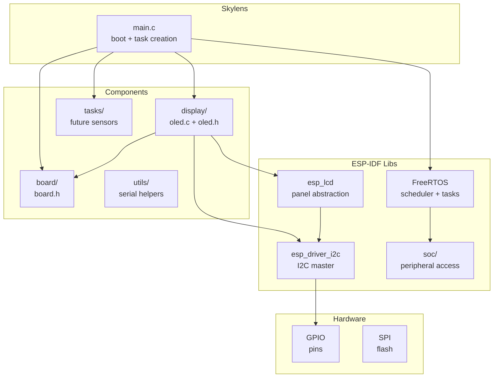
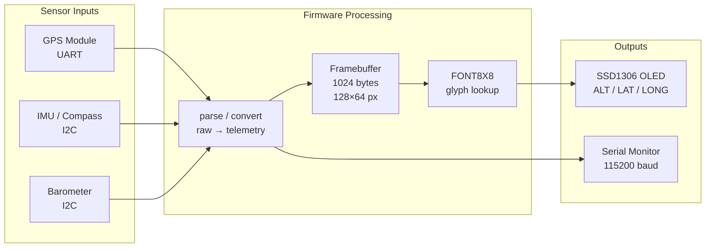
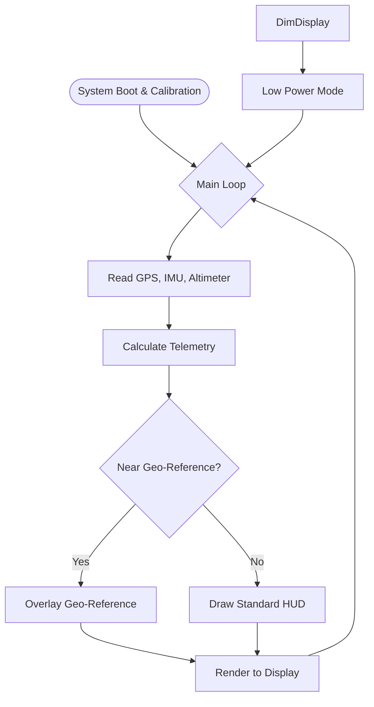

> In this new era, building stuff is easier and faster, that's awesome. As a builder, the main mantra: build fast, and iterate faster, it's possible.

## Idea

Sometimes, when I'm working on an entire software project, I can feel something boring 'cause it can't interact with the real world.
That is the greatest gap between software and hardware. Now, with some aid from LLMs ([OpenCode]), I can try to build something interesting.
I think to use my skills: _c, cpp, kicad, design schematics([KiCad])_ and so on.

## Stuff

My main goal is to build an _AR lens_ with the most common sparks at the market:

- ESP-WROOM-32
- OLED display 0.96"
- IMU-6050
- GLONASS/GPS module

I choose [FreeRTOS] as the primary program focused on real time telemetry.

For the glass frame I downloaded [Glasses frame] from [Thingiverse].

## Overview

> Hardware + Software layer abstraction

> Data flow

> Program logic

## Next steps

- [ ] New transparent screen
- [ ] Android/iOS application (Kotlin)
- [ ] New glass frame (3D model)
- [ ] PCB ready to fit in frame

Also, I'm working on a MCP for KiCad that enhances the creation experience and brings a comfortable experience, reducing friction between coding plans and building time.

[OpenCode]: https://opencode.ai/
[FreeRTOS]: https://www.freertos.org/
[Thingiverse]: https://www.thingiverse.com/
[KiCad]: https://www.kicad.org/
[Glasses frame]: https://www.thingiverse.com/thing:6098101
