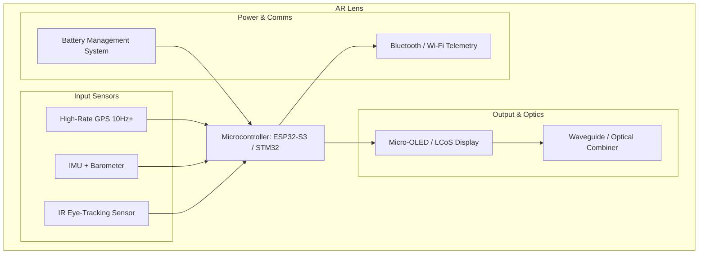

In this new era, building stuff are more easily and fast, that's awesome. As builder, the main mantra: build fast, and iterate faster, it's possible.

## Stuff

My main goal is build an AR lens with the most common sparks at the market:

- ESP-WROOM-32
- OLED display 0.96"
- IMU-6050
- GLONASS/GPS module

This is is good for an started point, in the next iteration can be refined.

I thinks in freeRTOS for real time telemetry, this is an simple started project for another more complex: lens, AR, sky...

## Concepts

> AR concepts architecture

## Next steps

I'm working on an MCP for KiCad that enhanced the creation experience and brings and comfortable experience between makers, reducing
fictions between coding plans and building time, and at the same time, building an bridge (another MCP) for Blender 3D for printer creations.

[OpenCode]: https://opencode.ai/
