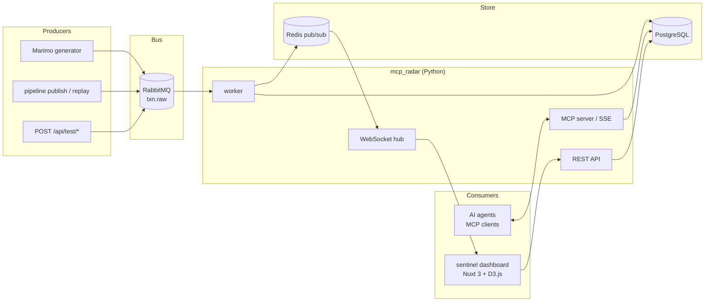
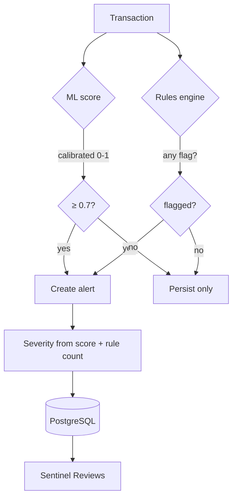

## Motivation

When AI starts has a relevant participation inside any organization, the main issue it's create some really useful tools.
Also, a organization has a lot information that must be well structure and retrieve under easy ways.

MCP's can be helpful in some scenarios.

Sentinel Ops (MCP + ML) it's an PoC that can handle a some business rules, send alerts and create profiles. It's an combination
between MCP, Machine Learning and visualization actions (live monitoring).

In any business that involves money or resources the hard decisions must be taken with a lot of information, the risk must be minimum.

## Architecture overview

> NOTE: This is a first iteration, maybe contains some errors.

The architecture, at this time, it's a little simple: train with transactions -> creation model -> run model -> audit transactions -> trigger an alert -> MCP works

## How alert system works

In the remain iterations, some issues must be covered, also, the dashboard must be integrate some AI chat that
can handle prompts, generate reports and so on.

You can access to full code from this repo: [martinsgmx/sentinel-ops.git]

[martinsgmx/sentinel-ops.git]: https://github.com/martinsgmx/sentinel-ops
