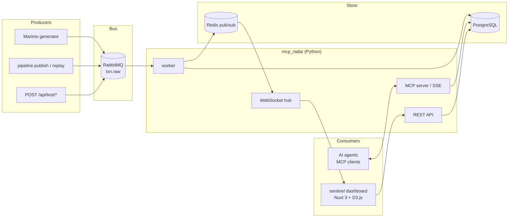
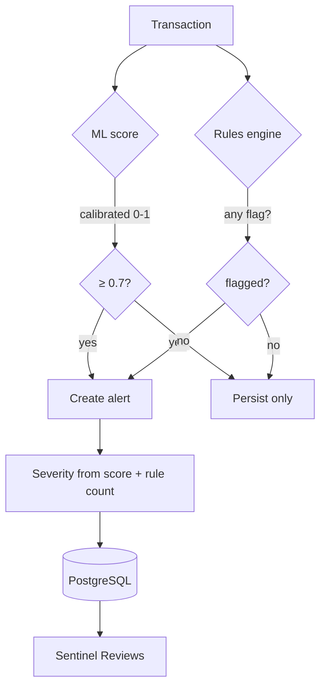

> You can access to full code from: [martinsgmx/sentinel-ops.git]

> For this PoC, the credit card transactions dataset are taken from: [kaggle.com/datasets/priyamchoksi/credit-card-transactions-dataset]

## Motivation

When AI starts to play an relevant role inside any organization, the main challenge is creating some really useful tools.
Also, an organization has a lot of information that must be well-structured and retrieve easily.

MCPs can be helpful in some scenarios.

Sentinel Ops (MCP + ML) it's a PoC that can handle business rules, send alerts and create profiles. It's a combination
between MCP, Machine Learning and visualization/actions (live monitoring).

In any business that involves money or valuable resources, critical decisions must based on as much relevant information as possible.
The goal is to minimized risk while making those decisions faster and more effectively.

## Architecture overview

> NOTE: As a first iteration, this version maybe contains some errors.

The architecture, at this time, it's a little simple: train with transactions -> creation model -> run model -> audit transactions -> trigger an alert -> MCP works

## How alert system works

This is a draft of how the alert system works. It will be complemented with MCP, AI agents, and other components.

In the remaining iterations, several issues need to be addressed. The dashboard should also integrate an AI chat interface capable of handling prompts, generating reports, and more.

[martinsgmx/sentinel-ops.git]: https://github.com/martinsgmx/sentinel-ops
[kaggle.com/datasets/priyamchoksi/credit-card-transactions-dataset]: https://www.kaggle.com/datasets/priyamchoksi/credit-card-transactions-dataset
