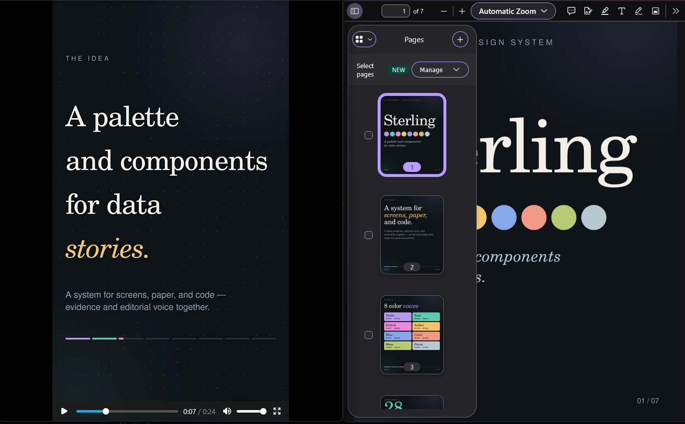

## TL;DR

> _for lazy devs, just like me..._

Ve directo a la sección: [Prompt](#prompt)

## Motivación

En ocasiones, cuando construimos algo, personal o no, tenemos esa innata necesidad de mostrarselo al mundo. Cuando se está en el
mundo del desarrollo ese sentimiento está presente, sin embargo el cómo hacerlo tiende a estar ausente, `softkills` le llaman.

Sin embargo, con el arribo de cientos de modelos de inteligencia artificial, esa tarea puede ser optimizada o reemplazada por un
sistema de inferencia.

> "I created the _OASIS_ because I never felt at home in the real world." - Ready Player One, _James Halliday_, 2011.

El camino para llegar a crear un video de presentación actualmente es facilisímo.

# Idea principal

Para ayudarnos de Claude, debemos tener algunas herramientas previamente instaladas en nuestro sistema:
[ffmpeg] y [volta].

Ambas herramientas deben ser accesibles desde CLI de tu sistema, asi que una vez instaladas, puedes verificar eso con un simple comando:

```bash
# para ffmpeg
ffmpeg --version

# para volta
volta --version
```

> `ffmpeg` es una herramienta para manipular video, Claude la usará para renderizar, sobreponer audio, o lo que sea necesario.

> `volta` es un gestor de versiones de **NodeJS**, simple, y poderoso, ayuda en temas de compatibiliad, y que la solución sea simple y rápida.

## Objectivo

Nuestra meta principal es crear un Media kit para aquellos proyectos que desarrollemos y que busquemos compartir en nuestras redes profesionales.

Para este caso, usaremos de ejemplo [Sterling] un proyecto OSS creado por [LaMatemaga].

## Manos a la obra

> "AI is to be told what to do, not asked." - _Unknown_

Ahora, ya tenemos mentalizado nuestro objectivo, es momento de comenzar nuestro prompt.

Antes de esto, escoge un nombre genérico para el proyecto, en este caso lo llamaré `mediakit`, crea una carpeta e inicializa un proyecto `node`:

```bash
# crear carpeta
mkdir ./mediakit && cd ./mediakit

# inicializa el proyecto
pnpm init
```

Abrimos, Claude.

En este punto, hay dos manera de trabajar: _primera_, ingresas el prompt directamente en Claude, o _utilizas_ un archivo llamado `PROMPT.md` para tener un versionamiento de lo que solicitas, en este caso
al ser un proyecto totalmente reutilizable y mejorable, te recomiendo utilizar el segundo método.

Yo usaré el método de archivo separado, para tener una mejor visibilidad en este post.

## Prompt

> En la vida, como en el arte, la experiencia propia es la llave de la especialidad.

Ahora, toma nota, esto ME SIRVE a mí, iterar, mejorar, depende de cada persona.

> Claude debe estar utilizando de preferencia _Opus 5.5_, y como fallback _Sonnet 5.5_

Modifica las lineas después de `<!-- LINKS DE REFENCIAS -->` dentro del prompt. Son variables que debes modificar dependiendo el scope del
kit que quieres generar.

También, puedes modificar la parte de los formatos requeridos, puedes utilizar como referencia la propia tabla presentada al final del `prompt`.

```markdown
Requiero generar un video/media para presentar un producto, el producto es [URL_PRODUCTO]

El video debe ser consistente, la información debe ser abstrata, y bien estructurada.

El video debe tener una sincronización con la música provista.

Tener una paleta de colores acorde al [URL_PRODUCTO].

Crea una carpeta, y pon en ella todo lo requerido para este video, incluyendo una carpeta llamada `output` en donde
pondrás todo los archivos generados.

En este punto, solo te pido los siguientes formatos:

- Instagram Reel
- Linkedin Slides.

Usa como referencia la tabla Video dimensions

<!-- LINKS DE REFENCIAS -->

[URL_PRODUCTO]: https://www.lamatemaga.com/en/portfolio/sterling
[MUSICA]: https://ncs.io/track/download/1882cfc6-baac-41d3-ab0f-067a0aa1175f

## Video dimensions

| Platform / asset               | Aspect ratio |          Pixels | Orientation | UI safe area                                     |
| ------------------------------ | -----------: | --------------: | ----------- | ------------------------------------------------ |
| **Instagram Feed — Portrait**  |          4:5 |     1080 × 1350 | Portrait    | ~60 px edges                                     |
| Instagram Feed — Square        |          1:1 |     1080 × 1080 | Square      | ~60 px edges                                     |
| Instagram Feed — Landscape     |       1.91:1 |      1080 × 566 | Landscape   | ~60 px edges                                     |
| **Instagram Reel**             |     **9:16** | **1080 × 1920** | Vertical    | **~250 px top / ~350 px bottom / ~60 px sides**  |
| **Instagram Story**            |     **9:16** | **1080 × 1920** | Vertical    | **~250 px top / ~350 px bottom / ~60 px sides**  |
| Facebook Feed — Portrait       |          4:5 |     1080 × 1350 | Portrait    | ~60 px edges                                     |
| Facebook Feed — Landscape      |       1.91:1 |      1200 × 630 | Landscape   | ~60 px edges                                     |
| **Facebook Reel / Story**      |     **9:16** | **1080 × 1920** | Vertical    | **~250 px top / ~350 px bottom / ~60 px sides**  |
| **LinkedIn Post**              |       1.91:1 |      1200 × 628 | Landscape   | ~60 px edges                                     |
| LinkedIn Post — Square         |          1:1 |     1200 × 1200 | Square      | ~60 px edges                                     |
| **LinkedIn Portrait**          |          4:5 |     1080 × 1350 | Portrait    | ~60 px edges                                     |
| **LinkedIn Video**             |         16:9 |     1920 × 1080 | Landscape   | ~60 px edges                                     |
| LinkedIn Video — Vertical      |         9:16 |     1080 × 1920 | Vertical    | ~200 px top / ~300 px bottom / ~60 px sides      |
| **X Post Image**               |         16:9 |      1600 × 900 | Landscape   | ~60 px edges                                     |
| X Post — Square                |          1:1 |     1080 × 1080 | Square      | ~60 px edges                                     |
| X Post — Portrait              |          4:5 |     1080 × 1350 | Portrait    | ~60 px edges                                     |
| **X Video**                    |         16:9 |     1920 × 1080 | Landscape   | ~60 px edges                                     |
| X Video — Vertical             |         9:16 |     1080 × 1920 | Vertical    | ~200 px top / ~300 px bottom / ~60 px sides      |
| **YouTube Thumbnail**          |         16:9 |      1280 × 720 | Landscape   | ~60 px edges                                     |
| **YouTube Video**              |         16:9 |     1920 × 1080 | Landscape   | ~60 px edges                                     |
| **TikTok Video**               |         9:16 |     1080 × 1920 | Vertical    | **~250 px top / ~350 px bottom / ~100 px sides** |
| TikTok Photo                   |         9:16 |     1080 × 1920 | Vertical    | ~250 px top / ~350 px bottom / ~100 px sides     |
| **Pinterest Pin**              |          2:3 |     1000 × 1500 | Portrait    | ~60 px edges                                     |
| Pinterest Idea / Video         |         9:16 |     1080 × 1920 | Vertical    | ~250 px top / ~350 px bottom / ~60 px sides      |
| **Threads Image**              |          1:1 |     1080 × 1080 | Square      | ~60 px edges                                     |
| Threads Portrait               |          4:5 |     1080 × 1350 | Portrait    | ~60 px edges                                     |
| **WhatsApp Status**            |         9:16 |     1080 × 1920 | Vertical    | ~250 px top / ~350 px bottom / ~60 px sides      |
| **OpenGraph / Social Preview** |       1.91:1 |      1200 × 630 | Landscape   | ~60 px edges                                     |
| **Favicon**                    |          1:1 |       512 × 512 | Square      | ~10–15% internal padding                         |
| **App Icon**                   |          1:1 |     1024 × 1024 | Square      | ~10–15% internal padding                         |

## Toolchain

ffmpeg, volta, node, pnpm
```

En Claude:

```bash
Sigue las instruciones en @PROMPT.md
```

> La magia ocurre.

Una vez que finalice, dentro de la carpeta `output`, encontraremos una estructura parecida a:

```bash
output
├── output/sterling-instagram-reel-1080x1920.mp4
├── output/sterling-linkedin-carousel-1080x1350.pdf
├── output/sterling-linkedin-slide-01-1080x1350.png
├── output/sterling-linkedin-slide-02-1080x1350.png
├── output/sterling-linkedin-slide-03-1080x1350.png
├── output/sterling-linkedin-slide-04-1080x1350.png
├── output/sterling-linkedin-slide-05-1080x1350.png
├── output/sterling-linkedin-slide-06-1080x1350.png
└── output/sterling-linkedin-slide-07-1080x1350.png

1 directory, 9 files

```



En este punto, el prompt es básico, pero puedes agregar secciones de duración, incluso de [Viral Social Media Hooks]

```bash
Intenta que el video siga algunas cuestiones sobre la retención de atención de los usuarios:
- Durante los primeros 6 segundos, asegúrate que el video sea cautivador.
- El video no debe exceder los 45 segundos, sé consistente.
```

[ffmpeg]: https://ffmpeg.org/download.html
[volta]: https://docs.volta.sh/guide/getting-starte
[Sterling]: https://www.lamatemaga.com/en/portfolio/sterling
[LaMatemaga]: https://github.com/LaMatemaga
[Viral Social Media Hooks]: https://www.backstage.com/magazine/article/social-media-hook-examples-80055/
